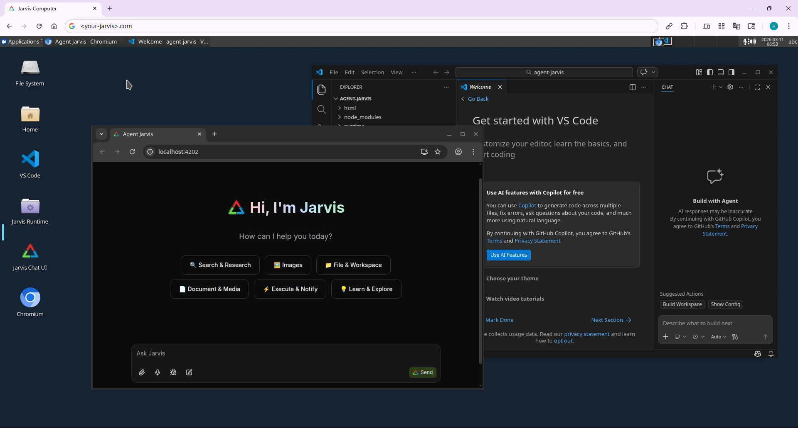

# Agent Jarvis

An autonomous AI assistant that learns, remembers, and acts for you—with a persistent workspace and containerized deployment.

## What It Does

Jarvis is self-learning and proactive: reflects after tasks, logs insights, and anticipates needs. Diaries, notes, skills, and cron tasks live in a persistent workspace, so context carries over. It runs web search, file ops, shell commands, and browser automation end-to-end. Chat via web UI or Telegram.

## Differs from other “Claws”

- **Single session** — One linear conversation, one shared context. No lanes or per-sender routing. Closer to talking to one person: coherent, predictable, human-like.

- **Lightweight** — Fast startup, minimal config. Markdown-based storage only. Pure TypeScript/Bun stack, no external services required; runs fully local.

- **Flexible deployment** — **Full** image: Ubuntu XFCE desktop (Webtop), Chromium, VS Code for browser automation. **Lite** image: Chat UI only, lighter footprint.

## Deploy with Docker

- **Full** (desktop + browser automation, 4G RAM required): [`docs/assets/docker-compose.example.yml`](docs/assets/docker-compose.example.yml)
- **Lite** (Chat UI only): [`docs/assets/docker-compose-lite.example.yml`](docs/assets/docker-compose-lite.example.yml)

Create a deploy directory, set up the compose file and `config.ts` (see [Configuration](docs/config.md)), then run `docker compose up -d`.

See [Docker deployment](docs/docker.md) for more details.

## Access Control

If the service is exposed to the internet, set up access control. Choose one approach—they cannot be used together:

- **Built-in auth**: Set the `PASSWORD` environment variable in `docker-compose.yml` to enable **HTTP Basic Authentication** for the Jarvis web server (default username: `abc`). In the Full image, `PASSWORD` also protects Webtop.
- **Reverse proxy** (recommended): Put the stack behind [Nginx Proxy Manager](https://nginxproxymanager.com/) or similar for SSL and access control. **Do not set `PASSWORD`** when using a proxy—configure auth at the proxy layer instead.

## Local development

1. `bun ci`
2. `bun dev`

Open `http://localhost:3000` in your browser to access the Jarvis web server.
