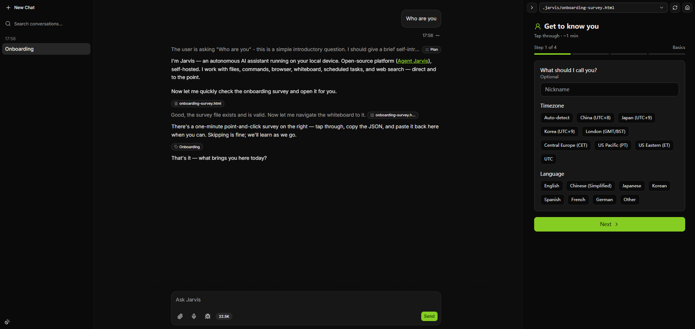

# Agent Jarvis

A self-hosted AI assistant you run in Docker—complete with a shared desktop, an interactive whiteboard, and a filesystem you can read and edit yourself.




## Why Choose Jarvis

- **Docker desktop workstation** — The **Full** image ships a pre-debugged Ubuntu desktop with browser, code editor, local search, and chat UI already wired together. Open the desktop beside chat to work human-in-the-loop—step in for CAPTCHAs or logins, then let Jarvis continue. Scoped Docker volumes keep the agent sandboxed from your host; one `docker compose up`, lighter than a full VM.

- **Whiteboard for visual collaboration** — A side panel shows interactive pages Jarvis builds for you—charts, forms, dashboards, prototypes. View and interact on screen, then paste results back into chat. Each conversation keeps its own canvas.

- **Everything is files** — Memory, skills, projects, and scheduled jobs are plain text and folders you can open in any editor—no opaque database. Jarvis reads and updates them as it works; you can inspect, edit, back up, or version-control them directly.

## Features

| Area                  | Details                                                                                       |
| --------------------- | --------------------------------------------------------------------------------------------- |
| **Planning**          | Task board each turn—see what Jarvis intends to do before it acts                             |
| **Files & shell**     | Read, write, and organize files; run terminal commands inside the workspace                   |
| **Web**               | Search and extract web content; optional Tavily API; Full image bundles a local search engine |
| **Browser (Full)**    | Automate websites on the shared desktop; step in anytime via VNC                              |
| **Subagents**         | Background workers for heavy research; understands audio, images, PDFs, and video             |
| **Automation**        | Recurring jobs defined in markdown; scheduler picks up changes automatically                  |
| **Whiteboard**        | Side-panel charts, forms, and dashboards; one canvas per conversation; works on mobile        |
| **Notifications**     | Sidebar alerts and optional browser push when tasks complete                                  |
| **Image**             | Generate and edit images from chat                                                            |
| **Memory**            | Persistent notes, reusable skill playbooks, and long-term project folders                     |
| **Sessions**          | Multiple parallel conversations, file attachments, voice input, searchable history            |
| **Long chats (Full)** | Automatic context compression keeps extended sessions usable                                  |
| **Desktop (Full)**    | Linux desktop with browser, VS Code, and dev tools; state persists across restarts            |
| **Chat UI**           | Real-time updates and visible progress as tools run                                           |
| **AI providers**      | Mix LLMs and multimodal models; configuration hot-reloads without restart                     |
| **Deployment**        | **Full** — integrated desktop (~4 GB RAM); **Lite** — chat only, lighter footprint            |
| **Access control**    | Built-in password or reverse-proxy auth; scoped storage isolates the agent from your host     |

## Deploy with Docker

- **Full** (recommended — integrated desktop workstation; ~4 GB RAM): [`docker-compose.example.yml`](docker-compose.example.yml)
- **Lite** (chat UI only, no desktop): [`docker-compose-lite.example.yml`](docker-compose-lite.example.yml)

Create a deploy directory, copy the compose file to `docker-compose.yml`, set up `config.json` (see [Configuration](docs/config.md)), then run `docker compose up -d`.

See [Docker deployment](docs/docker.md) for ports, volumes, and build instructions.

## Access Control

If the service is exposed to the internet, set up access control. Choose one approach—they cannot be used together:

- **Built-in auth**: Set the `PASSWORD` environment variable in `docker-compose.yml` to enable **HTTP Basic Authentication** for the Jarvis web server (default username: `abc`). In the Full image, `PASSWORD` also protects Webtop.
- **Reverse proxy** (recommended): Put the stack behind [Nginx Proxy Manager](https://nginxproxymanager.com/) or similar for SSL and access control. **Do not set `PASSWORD`** when using a proxy—configure auth at the proxy layer instead.

## Local development

1. Copy `config.example.json` to `config.json` and add at least one LLM provider.
2. `bun ci`
3. `bun dev`

Open `http://localhost:3000` for the UI (Vite dev server). The API runs on port `4000` and is proxied at `/jarvis`.

To reset the local runtime workspace: `bun dev:reset`.

## Project layout

```
apps/server/          Bun/Elysia backend and Jarvis agent
apps/frontend/        React chat UI
packages/shared/      Shared types and utilities
apps/server/runtime-template/   Seed workspace copied on first boot
runtime/              Live workspace (dev; created on first run)
docs/                 Configuration and Docker guides
```

## Documentation

- [Configuration](docs/config.md) — `config.json`, providers, Tavily
- [Docker deployment](docs/docker.md) — Full vs Lite, ports, volumes, troubleshooting
